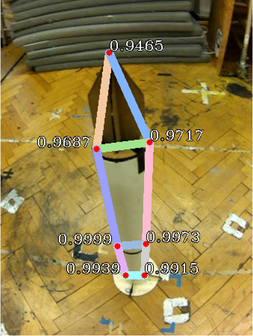
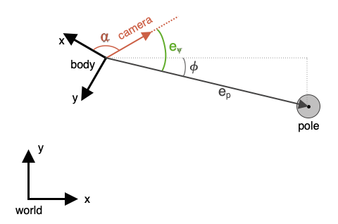

 # Object Pose Estimation & Visual Servoing
 
 This Repo contains the source code used to run the object pose estimation model and the visual servoing algorithm for the [Geranos Drone](https://github.com/Geranos-Drone). The pose estimation is based on the [OpenPifPaf](https://github.com/vita-epfl/openpifpaf) human pose estimation model. 
 
 
## Object Pose Esimation: OpenPifPaf, OpenCV, Python

The pose estimation, optimized for long vertical poles, is done in a two step approach. First seven keypoints are detected in the image recorded onboard the drone using OpenPifPaf. We trained the OpefPifPaf model on a costum annotated dataset of 671 images.

Then the seven keypoints are used to estimate the pose of the object in the camera frame. With the 3D correspondences in the object frame of the keypoints, the pose can be estimated using the PnP Algorithm. We used the OpenCV implementation of the PnP.

## Visual Servoing: C++, ROS

We used a position based visual servoing approach to calculate position and orientation commands for the controller. First position and orientation errors are calculated using the pose of the UAV and the estimated pose of the object.

The yaw error and position error are then used to calculate pose commands for the controller using a proportional control law.
